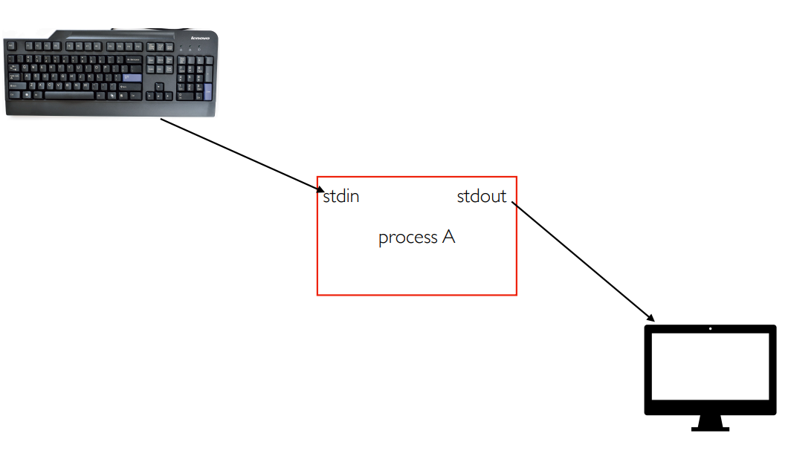

# Lecture 5

## Regularization

**Data Augmentation**

* Horizontal flips
* Random crops and scales.
* Color: contrast and brightness

## Attention and Transformer

&#x20;**RNNs**

Input and Output:

* one to one
* one to many
* many to one
* many to many
* many to many (aligned)

Sequence to Sequence

Input: Sequence $$x_1, \dots, x_T$$

Output: Sequence $$y_1, \dots, y_{T^\prime}$$

Encoder: $$h_t = f_w(x_t, h_{t-1})$$

<figure><figcaption></figcaption></figure>

From initial hidden state predict: initial decoder state $$s_0$$, context vector $$c$$

Decoder: $$s_t = g_u(y_{t-1}, s_{t-1}, c)$$

### Attention

Compute alignment scores $$e_{t,i} = f_{att}(s_{t-1}, h_i)$$, $$f_{att}$$ is an MLP.

Normalize aligment scores to get attention weights $$0 < a_{t,i} < 1, \sum_i a_{t,i} = 1$$

context vector as $$c_t = \sum_i a_{t,i} h_i$$

<figure><figcaption>
With attention
</figcaption></figure>

Repeat: use $$s_1$$ to compute new context vector $$c_2$$, use $$c_2$$ to compute $$s_2, y_2$$

Use a different context vector in each timestep of decorder. Input sequence not bottlenecked through single vector. At each timestep of decoder, context vector looks at different part of sequence.

Decoder doesn't use the fact that $$h_i$$ form an ordered sequence, treat them as unordered. Can use similar architecture given any set of vectors $$\{h_i\}$$

### Images with RNNs and Attention

<figure><figcaption></figcaption></figure>

