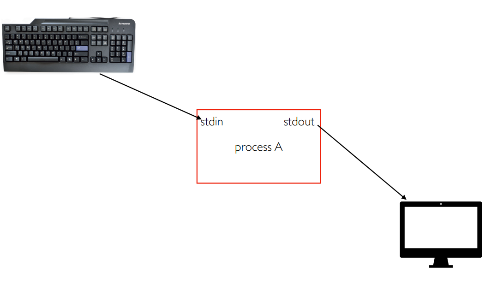

# Lecture 7

## Generative Models

Supervised Learning: data and label, learn a function to map x -> y.

Unsupervised: just data, no labels. Learn some underlying hidden structure of data.

&#x20;**Discriminivative vs Generative Models**

DIscrimininative Modle: learn a probability distribution $$p(x|y)$$

Generative Model: learn a probability distribution $$p(x)$$

Conditional Generative Model, learn $$p(x|y)$$

**Density Function**

$$p(x)$$ assigns a positive number to each possible $$x$$; higher numbers mean $$x$$ is more likely.

Normalized:

$$\int_X p(x)dx = 1$$

Different values of $$x$$ comptete density.

Discriminative: Density function, $$p(x)$$ assigns a positive number to each possible $$x$$. Higher numbers mean $$x$$ is more likely. Possible labels for each input comptete for probability mass. But no competition between images.

No way for model to handle unreasonable inputs, it must give label distribution for all images.

Generative Model: all possible images compete with each other for probability mass.

Requires deep image understanding. Model can reject unreasonable input by assigning them small values.

Conditional Generative Model: each possible label induces a competition among all images.

Recall Bayes rule:

$$
P(x|y) = \frac{P(y|x)}{P(y)}P(x)
$$

<figure><figcaption>
Bayes
</figcaption></figure>

Discriminative -> Assign labels to data Feature Learning (with labels)

Generative -> Detect outliers. Feature learning (without labels). Sample to generate new data.

Conditional -> Assign labels, while rejecting outliers. Generate new data conditioned on input labels.

Taxonomy of Generative Models

<figure><figcaption>
Generative Model taxonomy
</figcaption></figure>

## Autoregressive Model

Goal: explicit function for $$p(x) = f(x, W)$$

Given dataset $$x^{(1)}, x^{(2)}, \dots, x^{(N)}$$, train the model by solving:

$$W^* = \argmax_W \prod_i p(x^{(i)})$$ Maximize probability of training data

$$= \argmax_W \sum_i \log p(x^{(i)})$$ Log trick to exchange product for sum

$$=\argmax_W \sum_i \log f(x^{(i)}, W)$$ Loss function, train for GD.

Assume $$x$$ consist of multiple subparts: $$x = (x_1, x_2, x_3, \dots, x_T)$$

Break down probability using chain rule: $$p(x) = p(x_1, x_2, x_3, \dots, x_T) = p(x_1)p(x_2|x_1)p(x_3|x_1, x_2)\dots$$

$$= \prod_{t=1}^T p(x_t|x_1, \dots, x_{t-1})$$ Probability of next subpart given all previous subparts.

.png>)

### Pixel RNN

Generate image pixels one at a time, starting at upper left corner.

Compute hidden state for each pixel that depends on hidden states and RGB from left and above.

$$
h_{x,y} = f(h_{x-1,y}, h_{x, y-1}, W)
$$

At each pixel, predict red, then blue, then green, softmax over $$[0,1,\dots,255]$$

Each pixel depends implciity on all pixels above and left.

Problem: slow during training and testing, N x N image requires 2N-1 sequential steps.

